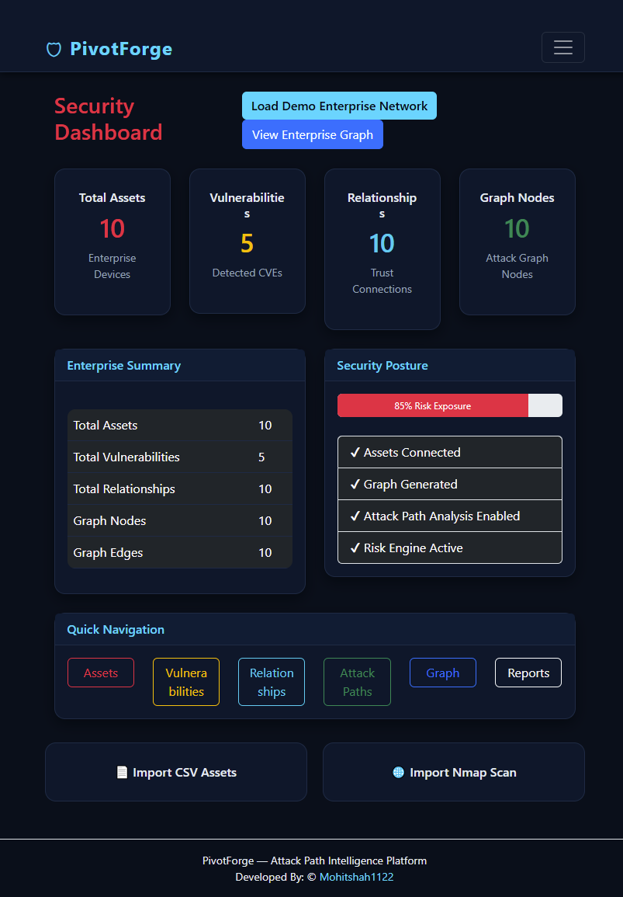
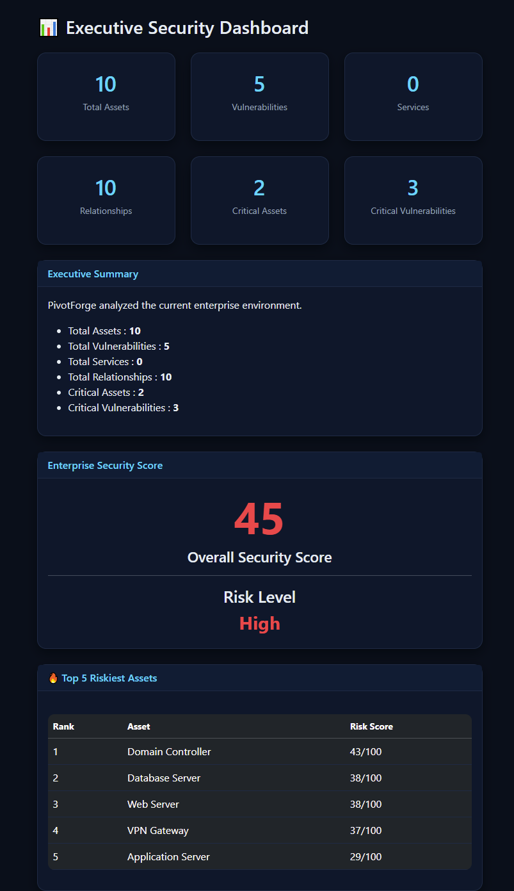
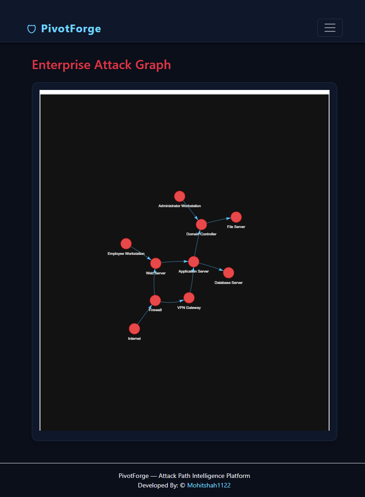
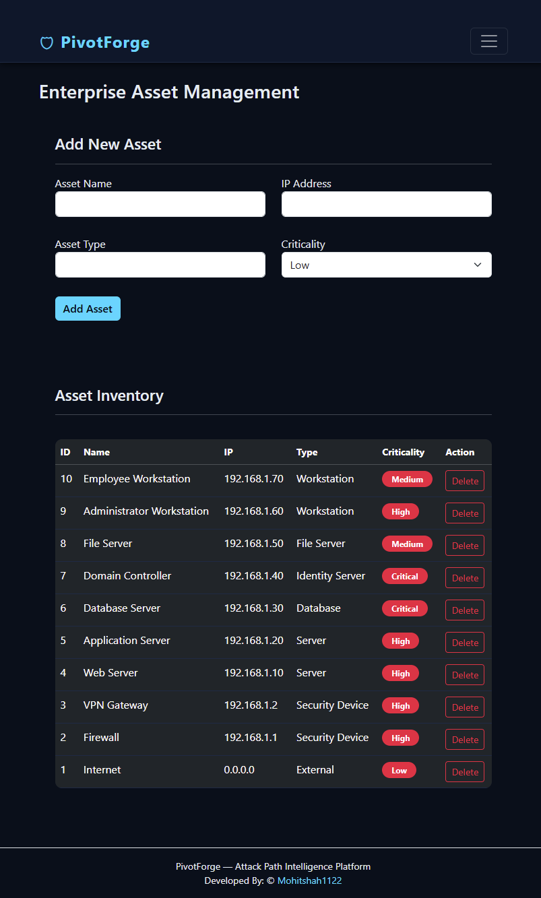
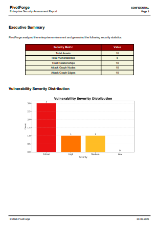

<div align="center">

# PivotForge

### **Visualizing the Path Before the Breach.**

Professional Enterprise Attack Path Intelligence Platform for Security Teams


---

### Enterprise Cybersecurity • Attack Path Intelligence • Risk Analytics • Visualization Platform

</div>

---

# 📖 Overview

**PivotForge** is a professional web-based **Attack Path Intelligence Platform** designed to help security analysts, blue teams, SOC engineers, penetration testers, and enterprise security architects understand how attackers can move laterally across an enterprise network.

Instead of viewing assets and vulnerabilities independently, PivotForge models the relationships between systems, services, vulnerabilities, and network connectivity to generate attack paths that reflect realistic attacker movement.

The platform combines visualization, asset inventory, vulnerability management, risk analytics, service discovery, reporting, and executive dashboards into a single unified application.

Whether analyzing a small lab environment or a large enterprise infrastructure, PivotForge provides a clear view of organizational cyber exposure and enables security teams to prioritize remediation efforts based on attack paths rather than isolated findings.

---

# ✨ Key Objectives

- Visualize enterprise infrastructure
- Model asset relationships
- Discover exposed services
- Analyze attack paths
- Calculate enterprise risk
- Generate executive reports
- Improve remediation prioritization
- Support cybersecurity education and demonstrations

---

# 📚 Table of Contents

- [Overview](#-overview)
- [Key Objectives](#-key-objectives)
- [Features](#-features)
- [Screenshots](#-screenshots)
- [Technology Stack](#-technology-stack)
- [Architecture](#-architecture)
- [Project Structure](#-project-structure)
- [Installation](#-installation)
- [Usage](#-usage)
- [Workflow](#-workflow)
- [Highlights](#-highlights)
- [Roadmap](#-roadmap)
- [Contributing](#-contributing)
- [License](#-license)
- [Author](#-author)
- [Acknowledgements](#-acknowledgements)

---

# 🚀 Features

| Feature | Description |
|----------|-------------|
| 🖥 Asset Inventory Management | Maintain a centralized inventory of enterprise assets including servers, endpoints, routers, firewalls, and workstations. |
| 🔐 Vulnerability Management | Store, organize, prioritize, and manage vulnerabilities affecting enterprise assets. |
| 🔗 Relationship Management | Build relationships between systems to accurately represent enterprise infrastructure. |
| 🌐 Enterprise Attack Graph | Generate visual attack graphs illustrating attacker movement throughout the organization. |
| 🎯 Attack Path Engine | Identify potential attack paths using modeled relationships and vulnerabilities. |
| 📊 Risk Engine | Calculate organizational cyber risk using weighted attack path analysis. |
| ⚠ Asset Risk Engine | Determine risk scores for individual assets based on vulnerabilities and exposure. |
| 🔍 Automatic Service Discovery | Import Nmap XML scans to discover live hosts, services, and open ports automatically. |
| 📈 Executive Dashboard | Present high-level KPIs, metrics, and enterprise risk summaries. |
| 🔎 Global Search | Instantly search assets, services, vulnerabilities, IP addresses, and relationships. |
| 📥 CSV Import | Bulk import enterprise asset inventories using CSV files. |
| 📡 Nmap XML Import | Import scan results directly from Nmap XML exports. |
| 📄 PDF Report Generation | Produce professional cybersecurity assessment reports using ReportLab. |
| 📉 Charts & Analytics | Interactive dashboards and visual analytics for security posture assessment. |
| 🏢 Enterprise Demo Network Loader | Load a complete sample enterprise environment for demonstrations and testing. |
| 📝 Audit Logs | Record critical user actions to support accountability and traceability. |
| 🎨 Professional Cybersecurity UI | Modern Bootstrap-based interface designed for enterprise environments. |

---

# 🖼 Screenshots

## Dashboard



---

## Executive Dashboard



---

## Enterprise Attack Graph



---

## Asset Inventory



---

## Professional Reports



---

# 💻 Technology Stack

| Category | Technology |
|----------|------------|
| Backend | Python |
| Framework | Flask |
| Database | SQLite |
| Frontend | HTML5 |
| Styling | CSS3 |
| UI Framework | Bootstrap 5 |
| Client Side | JavaScript |
| Reporting | ReportLab |
| Data Import | CSV |
| Scan Import | XML |

---

# 🏗 Architecture

```text
                    ┌─────────────────────┐
                    │       Users         │
                    └──────────┬──────────┘
                               │
                               ▼
                ┌──────────────────────────┐
                │   Flask Web Application  │
                └──────────┬───────────────┘
                           │
                           ▼
             ┌───────────────────────────────┐
             │    Business Logic Modules     │
             └──────────┬────────────────────┘
                        │
        ┌───────────────┴────────────────┐
        │                                │
        ▼                                ▼
┌───────────────────┐          ┌──────────────────┐
│ Attack Path Engine│          │    Risk Engine   │
└─────────┬─────────┘          └─────────┬────────┘
          │                              │
          └──────────────┬───────────────┘
                         ▼
               ┌───────────────────┐
               │ SQLite Database   │
               └─────────┬─────────┘
                         │
          ┌──────────────┴──────────────┐
          ▼                             ▼
┌─────────────────────┐       ┌───────────────────┐
│ Executive Dashboard │       │   PDF Reports     │
└─────────────────────┘       └───────────────────┘
```

---

# 📂 Project Structure

```text
PivotForge/

│

├── app.py

├── config/

├── modules/

├── static/

│   ├── css/

│   ├── js/

│   └── images/

├── templates/

├── database/

├── uploads/

├── reports/

├── assets/

│   └── screenshots/

├── requirements.txt

├── LICENSE

└── README.md
```

---
---

# ⚙️ Installation

## Prerequisites

Before installing PivotForge, ensure your system meets the following requirements:

| Requirement | Version |
|-------------|---------|
| Python | 3.13 or later |
| Git | Latest |
| pip | Latest |
| Operating System | Windows, Linux, macOS |

---

## Clone the Repository

```bash
git clone https://github.com/Mohitshah1122/PivotForge.git
```

---

## Navigate to the Project Directory

```bash
cd PivotForge
```

---

## Create a Virtual Environment

```bash
python -m venv venv
```

---

## Activate the Virtual Environment

### Windows

```bash
venv\Scripts\activate
```

### Linux / macOS

```bash
source venv/bin/activate
```

---

## Install Dependencies

```bash
pip install -r requirements.txt
```

---

## Launch the Application

```bash
python app.py
```

By default, the application will be available at:

```
http://127.0.0.1:5000
```

---

# 🚀 Usage

PivotForge is designed around a simple yet powerful workflow that enables security teams to model enterprise infrastructure, identify attack paths, and generate actionable insights.

---

## 1. Launch the Application

Start the Flask server and open the application in your preferred web browser.

The landing dashboard provides an overview of:

- Enterprise assets
- Vulnerabilities
- Attack paths
- Risk metrics
- Recent activity
- Executive KPIs

---

## 2. Load the Enterprise Demo Network

New users can quickly explore the platform by loading the built-in enterprise demonstration environment.

The demo network includes:

- Multiple departments
- Servers
- User workstations
- Domain controllers
- Routers
- Firewalls
- Web servers
- Database servers
- Sample vulnerabilities
- Asset relationships

This allows users to immediately experiment with attack path visualization without manually entering data.

---

## 3. Import Enterprise Assets

Bulk import organizational assets using CSV files.

Supported asset information includes:

- Hostname
- IP Address
- Operating System
- Department
- Asset Owner
- Criticality
- Device Type
- Business Unit

CSV importing significantly accelerates enterprise onboarding.

---

## 4. Import Nmap XML Scans

PivotForge supports direct importing of Nmap XML output.

Imported information may include:

- Live hosts
- Open ports
- Running services
- Service versions
- Operating system fingerprints
- Network discovery data

Service discovery automatically enriches the enterprise inventory.

---

## 5. Manage Assets

Administrators can:

- Add assets
- Edit assets
- Delete assets
- Assign ownership
- Categorize devices
- Update business impact
- Track lifecycle information

Each asset becomes a node within the enterprise attack graph.

---

## 6. Manage Vulnerabilities

Associate vulnerabilities with enterprise assets.

Examples include:

- Missing patches
- Weak configurations
- Exposed services
- Credential weaknesses
- Misconfigurations
- Known CVEs

Each vulnerability contributes to overall attack path risk calculations.

---

## 7. Build Infrastructure Relationships

Relationships model how attackers may pivot between systems.

Examples include:

- Connected To
- Hosts
- Communicates With
- Depends On
- Trust Relationship
- Database Connection
- Domain Membership

These relationships become edges within the enterprise attack graph.

---

## 8. Visualize the Enterprise Attack Graph

Generate an interactive graph representing:

- Assets
- Relationships
- Trust paths
- Vulnerability chains
- Potential attacker movement

The visualization enables analysts to quickly understand possible lateral movement opportunities.

---

## 9. Analyze Attack Paths

PivotForge evaluates enterprise relationships to identify possible attack paths.

Analysis considers:

- Asset connectivity
- Vulnerability exposure
- Critical systems
- Relationship chains
- Service availability

This enables defenders to prioritize remediation based on realistic attacker behavior rather than isolated vulnerabilities.

---

## 10. Generate Professional Reports

Generate executive-ready PDF reports containing:

- Executive summary
- Asset inventory
- Vulnerability overview
- Risk analysis
- Attack graph summaries
- Charts
- Recommendations

Reports are suitable for management presentations and security assessments.

---

## 11. Use Global Search

Instantly search across:

- Assets
- Services
- Vulnerabilities
- Hostnames
- IP addresses
- Relationships

Global search improves navigation within large enterprise environments.

---

# 🔄 Operational Workflow

```text
                 Import Assets
                        │
                        ▼
               Import Nmap XML
                        │
                        ▼
             Discover Running Services
                        │
                        ▼
           Manage Vulnerabilities
                        │
                        ▼
          Build Asset Relationships
                        │
                        ▼
        Generate Enterprise Attack Graph
                        │
                        ▼
          Analyze Attack Paths
                        │
                        ▼
           Calculate Enterprise Risk
                        │
                        ▼
        Generate Executive PDF Reports
```

---

# 🧩 Core Platform Modules

| Module | Purpose |
|--------|---------|
| Asset Inventory | Centralized enterprise asset management |
| Vulnerability Manager | Store and organize asset vulnerabilities |
| Relationship Manager | Build logical connections between infrastructure components |
| Attack Graph Engine | Generate visual attack graphs |
| Attack Path Engine | Evaluate potential attacker movement |
| Risk Engine | Calculate enterprise and asset risk scores |
| Service Discovery | Parse Nmap XML scans and discover exposed services |
| Executive Dashboard | Display enterprise KPIs and cybersecurity metrics |
| Reporting Engine | Generate professional PDF reports |
| Audit Logs | Record important application activities |
| Global Search | Unified search across platform data |

---

# 🎯 Attack Path Engine

The Attack Path Engine models how an attacker may traverse enterprise infrastructure using asset relationships, exposed services, and known vulnerabilities.

### Capabilities

- Multi-hop path analysis
- Lateral movement visualization
- Relationship traversal
- Critical asset prioritization
- Exposure mapping
- Attack chain simulation
- Infrastructure graph generation

The engine enables defenders to identify high-risk attack routes before adversaries can exploit them.

---

# 📊 Risk Engine

PivotForge includes a dedicated risk engine for evaluating organizational cyber exposure.

Risk calculations consider factors such as:

- Asset criticality
- Vulnerability severity
- Network exposure
- Service availability
- Relationship complexity
- Attack path length
- Privilege escalation opportunities

The resulting scores help prioritize remediation efforts based on business impact.

---

# 📡 Automatic Service Discovery

The Service Discovery module parses Nmap XML scan results to automatically enrich the enterprise asset inventory.

Detected information may include:

- Host status
- Open ports
- Service names
- Service versions
- Operating system detection
- Host discovery information

This reduces manual data entry while improving inventory accuracy.

---

# 📈 Executive Dashboard

The Executive Dashboard provides leadership with a high-level overview of the organization's cybersecurity posture.

Typical metrics include:

- Total enterprise assets
- Critical assets
- Vulnerabilities
- High-risk systems
- Attack paths
- Risk score trends
- Service distribution
- Security posture summaries

Designed for both technical teams and executive stakeholders, the dashboard supports informed decision-making.

---

# 📄 Professional Reporting

PivotForge generates polished PDF reports suitable for:

- Executive briefings
- Internal audits
- Security assessments
- Compliance documentation
- Client presentations
- Academic demonstrations

Reports consolidate technical findings into a clear, professional format with tables, charts, and actionable recommendations.

---

# 🔍 Global Search

The unified search feature enables analysts to quickly locate information across the platform.

Searchable entities include:

- Assets
- IP addresses
- Hostnames
- Vulnerabilities
- Services
- Relationships
- Departments
- Device types

This capability streamlines navigation within large enterprise environments.

---

# 🏢 Enterprise Demo Network

To simplify evaluation and demonstrations, PivotForge includes an enterprise demo environment.

The sample dataset contains representative infrastructure components such as:

- Domain Controllers
- Web Servers
- Database Servers
- Application Servers
- Employee Workstations
- Routers
- Firewalls
- Network Switches
- Common Services
- Sample Vulnerabilities
- Realistic Asset Relationships

The demo environment allows users to explore all major platform capabilities immediately after installation without requiring external data.
---

# 🌟 Highlights

PivotForge is designed to deliver a modern, enterprise-focused approach to Attack Path Intelligence by combining visualization, analytics, and risk assessment into a single platform.

| Capability | Description |
|------------|-------------|
| 🏢 Enterprise-grade Architecture | Modular Flask application with a clean and scalable project structure. |
| 🌐 Attack Path Visualization | Understand how attackers can traverse enterprise infrastructure through interactive attack graphs. |
| 📊 Executive Dashboards | High-level cybersecurity metrics designed for management and decision makers. |
| ⚠️ Risk Analytics | Calculate organizational and asset-level risk using attack path intelligence. |
| 🔎 Automatic Service Discovery | Import Nmap XML scans to enrich enterprise asset inventories automatically. |
| 📄 Professional PDF Reporting | Generate executive-ready reports suitable for audits, assessments, and presentations. |
| 🎨 Modern Cybersecurity UI | Responsive Bootstrap interface inspired by enterprise security platforms. |
| 📦 Bulk Data Import | Accelerate onboarding with CSV asset imports and Nmap XML scan ingestion. |
| 🔍 Unified Search | Instantly search assets, vulnerabilities, IP addresses, services, and relationships. |
| 📝 Audit Logging | Track significant application events to improve traceability and accountability. |

---

# 🚧 Roadmap

The following enhancements are planned for future releases of PivotForge.

| Status | Feature |
|--------|---------|
| ⏳ Planned | Role-Based Access Control (RBAC) |
| ⏳ Planned | Docker Support |
| ⏳ Planned | REST API |
| ⏳ Planned | MITRE ATT&CK Mapping |
| ⏳ Planned | Real-time Monitoring |
| ⏳ Planned | Cloud Asset Discovery |
| ⏳ Planned | CVE Feed Integration |
| ⏳ Planned | Multi-user Support |
| ⏳ Planned | LDAP / Active Directory Authentication |
| ⏳ Planned | Network Topology Mapping |
| ⏳ Planned | SIEM Integration |
| ⏳ Planned | Asset Tagging |
| ⏳ Planned | Scheduled Risk Assessments |
| ⏳ Planned | Interactive Graph Filtering |
| ⏳ Planned | Graph Export |
| ⏳ Planned | Dark Mode |
| ⏳ Planned | Email Alerting |
| ⏳ Planned | Threat Intelligence Integration |

---

# 🔐 Security Philosophy

PivotForge is built around the principle that understanding relationships between systems is just as important as identifying individual vulnerabilities.

The platform focuses on:

- Defense-first security analysis
- Enterprise visibility
- Risk prioritization
- Attack path awareness
- Clear executive communication
- Scalable infrastructure modeling

By emphasizing attack paths instead of isolated findings, PivotForge helps security teams focus remediation efforts where they have the greatest impact.

---

# 🛠 Development Principles

The project follows several core engineering principles.

| Principle | Description |
|-----------|-------------|
| Modularity | Independent modules with clear responsibilities |
| Readability | Clean, maintainable Python code |
| Scalability | Architecture designed for future expansion |
| Simplicity | Intuitive user experience with minimal complexity |
| Reusability | Components structured for easy reuse |
| Maintainability | Consistent coding standards throughout the project |
| Documentation | Comprehensive documentation for contributors |

---


# 📜 License

This project is licensed under the **MIT License**.

You are free to use, modify, distribute, and adapt this software in accordance with the terms of the MIT License.

For additional details, see the **LICENSE** file included in this repository.

---

# 👨‍💻 Author

## Mohit Shah

Cybersecurity Enthusiast • Software Developer • Security Researcher

### GitHub

https://github.com/Mohitshah1122

### Repository

https://github.com/Mohitshah1122/PivotForge

---

# 🙏 Acknowledgements

PivotForge draws inspiration from the cybersecurity community and the continuous efforts of security researchers, developers, and open-source contributors.

Special appreciation goes to:

- The Python community
- Flask contributors
- Bootstrap developers
- ReportLab project
- Nmap project
- OWASP community
- MITRE ATT&CK framework contributors
- Open-source cybersecurity researchers worldwide

Their tools, documentation, and knowledge continue to advance the field of cybersecurity.

---


<div align="center">

# PivotForge

### **Visualizing the Path Before the Breach.**

**Enterprise Attack Path Intelligence Platform**

Built with ❤️ using Python, Flask, SQLite, Bootstrap, HTML, CSS, and JavaScript.

---

**© 2026 Mohit Shah**

Released under the **MIT License**

</div>
